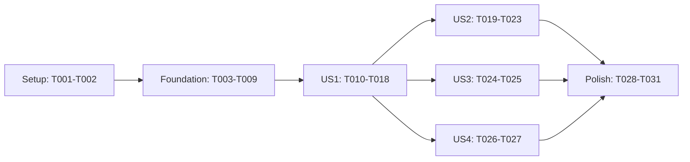

---
description: "Dependency-ordered implementation tasks for Admin Auth0 Authorization"
---

# Tasks: Admin Auth0 Authorization

**Input**: `specs/006-admin-auth0-authorization/spec.md`, `plan.md`, `research.md`, `data-model.md`, `contracts/admin-authorization.md`, and `quickstart.md`

**Tests**: Included because the specification requires independent route-level acceptance checks and the constitution requires tests for behavior and HTTP contracts.

**Organization**: Four user stories follow the spec's priority order. The 43-route contract is authoritative: 34 admin, five public catalog, and four existing customer review routes. No database migration or new business use case is needed.

## Format: `[ID] [P?] [Story] Description`

- **[P]** means the task can be authored in parallel with other marked tasks in its phase because it uses a different file and has no incomplete dependency.
- **[USn]** ties a task to User Story n.
- Every task names its target file or files.

## Phase 1: Setup (Shared Configuration)

**Purpose**: Expose the Auth0 configuration and deployment prerequisites before implementation.

- [ ] T001 [P] Add documented `AUTH0_DOMAIN` and `AUTH0_AUDIENCE` entries to `.env.example`, keeping `API_JWT_SECRET` as the separate customer secret and using no real credentials.
- [ ] T002 [P] Document RS256 API configuration, exact issuer/audience, the Auth0 **Add Permissions in the Access Token** setting, JWKS availability, and the separate customer auth path in `README.md`.

**Checkpoint**: Operators know which Auth0 API settings and environment variables the service requires.

---

## Phase 2: Foundational (Blocking Verification Components)

**Purpose**: Define the shared credential boundary and verifier before any route uses it. Finish this phase before user-story work.

- [ ] T003 Define the narrow `AdminIdentity` value and `AdminTokenVerifier` interface in `internal/domain/admin_auth.go`, with opaque admin `sub` and exact permission grants but no Gin, JWT, or Auth0 dependency.
- [ ] T004 [P] Write failing configuration tests in `internal/infrastructure/auth0/config_test.go` for required domain/audience, rejected scheme/path/userinfo, and exact `https://{AUTH0_DOMAIN}/` issuer plus fixed JWKS URL.
- [ ] T005 Implement validated Auth0 configuration and trusted issuer/JWKS URL derivation in `internal/infrastructure/auth0/config.go`, satisfying T004 without reading token-supplied URLs or reusing `API_JWT_SECRET`.
- [ ] T006 Write failing JWKS tests in `internal/infrastructure/auth0/jwks_test.go` using generated RSA keys and a local TLS server: exact `kid`, multiple keys, invalid/duplicate keys, five-minute cache hit/expiry, one bounded unknown-`kid` refresh per 60 seconds, coalesced concurrent fetches, timeout/oversized response, and fail-closed outage.
- [ ] T007 Implement the concurrency-safe, process-local RSA JWKS fetch/cache in `internal/infrastructure/auth0/jwks.go`: fixed HTTPS endpoint, bounded client/body, compatible JWK metadata, atomic refresh, no expired-key fallback, and no fetch on a fresh matching cache hit; satisfy T006.
- [ ] T008 Write failing verifier tests in `internal/infrastructure/auth0/verifier_test.go` for RS256 signature and matching `kid`, rejected HS256/`none`/forgery, exact `iss`, string and array `aud`, required `exp`, future `nbf`/`iat`, zero expiry leeway, opaque `sub`, and missing/empty/duplicate/malformed `permissions`.
- [ ] T009 Implement `domain.AdminTokenVerifier` in `internal/infrastructure/auth0/verifier.go` with `github.com/golang-jwt/jwt/v5`, selecting only the matching cached RSA key and returning trusted admin identity only after signature and claim validation; satisfy T008.

**Checkpoint**: The verifier accepts only correctly signed and intended Auth0 API tokens, and key retrieval is bounded and cached. Its tests require no live Auth0 service.

---

## Phase 3: User Story 1 — Perform an Authorized Management Action (Priority: P1) 🎯 MVP

**Goal**: A valid Auth0 token with a route's exact permission reaches the unchanged catalog, review-read, variant, or inventory handler.

**Independent Test**: For each of the 34 admin routes in `contracts/admin-authorization.md`, a locally signed RS256 token with the mapped grant reaches the existing handler; a token with several grants works when one matches. Confirm product update and reservation creation retain their normal business outcomes.

### Tests for User Story 1

- [ ] T010 [P] [US1] Write failing admin middleware success tests in `internal/delivery/http/middleware/admin/auth_test.go` for verified permissions and optional opaque subject in namespaced Gin context, exact permission membership, and ordered `RequireAuth` then `RequirePermission` execution.
- [ ] T011 [P] [US1] Write a failing table-driven authorized-route test in `internal/delivery/http/admin_authorized_routes_test.go` covering all 34 admin method/path/permission pairs from `specs/006-admin-auth0-authorization/contracts/admin-authorization.md` with local JWKS-signed RS256 tokens and fake business dependencies; assert the existing handler is reached, including product update, review reads, and reservation creation.
- [ ] T012 [P] [US1] Extend `internal/wire/container_test.go` with a failing assertion that the container owns one non-nil admin verifier/cache constructed from validated configuration and exposes it for router injection.
- [ ] T013 [P] [US1] Extend `cmd/server/gin_server_test.go` with failing startup tests for missing/malformed Auth0 config and a valid config that wires one verifier without a network fetch during construction.
- [ ] T014 [P] [US1] Adapt the existing registration test in `internal/delivery/http/router_routes_test.go` to the planned injected-verifier `SetupRouter` signature and preserve checks for the current route names.

### Implementation for User Story 1

- [ ] T015 [US1] Implement the separate admin `RequireAuth(verifier)` and `RequirePermission(permission)` pair in `internal/delivery/http/middleware/admin/auth.go`; parse one bearer credential, set verified admin context, require exact grant, and abort before handlers on rejection without modifying `internal/delivery/http/middleware/auth.go`.
- [ ] T016 [US1] Extend `internal/wire/container.go` to construct one Auth0 verifier from validated configuration and expose it through the container's domain port; update the `NewContainer` signature and satisfy T012.
- [ ] T017 [US1] Inject the admin verifier into `internal/delivery/http/router.go` and chain `adminAuth, admin.RequirePermission("<mapped grant>")` before each of the 34 handlers in `contracts/admin-authorization.md`; retain the five public GET and four customer review registrations as separate existing paths.
- [ ] T018 [US1] Update `cmd/server/gin_server.go` to validate `AUTH0_DOMAIN`/`AUTH0_AUDIENCE` before serving, pass configuration to `internal/wire`, inject its verifier into `SetupRouter`, and propagate safe startup errors; satisfy T013 and keep customer `API_JWT_SECRET` wiring.

**Checkpoint**: US1's 34 mapped admin actions reach existing operations with their exact grant. The old business payload, transaction, and reservation behavior is unchanged after authorization.

---

## Phase 4: User Story 2 — Reject Unauthenticated or Unauthorized Management (Priority: P1)

**Goal**: Every admin route distinguishes invalid credentials from insufficient permission and causes no protected action on denial.

**Independent Test**: For all 34 admin routes, missing, malformed, forged, expired, wrong-issuer, wrong-audience, unsupported-algorithm, and unavailable-key credentials return the safe 401 envelope; a valid token lacking the exact grant returns the safe 403 envelope. Denials never invoke handlers or mutate state.

### Tests for User Story 2

- [ ] T019 [P] [US2] Write failing route-level denial matrix tests in `internal/delivery/http/admin_denials_test.go` for all 34 method/path pairs, exact versus similar grants, absent/empty permissions, 401/403 body shape, unknown methods, and no handler invocation or write.
- [ ] T020 [P] [US2] Write failing metric tests in `internal/infrastructure/metrics/auth_metrics_test.go` for bounded auth outcome and route-template labels, with no token, subject, concrete ID, or permission-list label.

### Implementation for User Story 2

- [ ] T021 [US2] Complete strict bearer-header and denial behavior in `internal/delivery/http/middleware/admin/auth.go`: reject absent/wrong-scheme/empty/duplicate/ambiguous credentials with 401, return 403 only after valid authentication without the exact grant, and always use `{"error":{"code":"...","message":"...","details":{}}}` with safe fixed messages.
- [ ] T022 [US2] Add the bounded authorization outcome counter in `internal/infrastructure/metrics/metrics.go`, keyed only by method, registered route template, and fixed outcome; satisfy T020.
- [ ] T023 [US2] Record safe structured denial logs and the bounded outcome metric from `internal/delivery/http/middleware/admin/auth.go`, preserving internal error causes for diagnosis without logging bearer text, raw claims, subject, or resource identifiers; satisfy T019 and FR-009.

**Checkpoint**: US2's 401/403 matrix passes and protected handlers have zero calls on denied requests.

---

## Phase 5: User Story 3 — Preserve Customer Review Actions (Priority: P1)

**Goal**: Customer review create, update, delete, and own-review listing continue to use only the existing HS256 customer middleware and ownership rules.

**Independent Test**: Exercise all four customer routes with a valid customer token, no token, and an Auth0 admin token; repeat author-versus-non-author cases and verify a customer token returns 401 on an admin route.

### Tests and preservation work for User Story 3

- [ ] T024 [P] [US3] Add route-level customer regression tests in `internal/delivery/http/customer_review_auth_test.go` for the four review actions and existing ownership outcomes, confirming Auth0 tokens do not grant customer identity and customer tokens do not grant admin access.
- [ ] T025 [P] [US3] Extend `internal/delivery/http/middleware/auth_test.go` to prove the existing HS256 `RequireAuth(secret)` still sets customer UUID context for valid customer tokens and rejects RS256 Auth0 tokens; keep `internal/delivery/http/middleware/auth.go` unmodified.

**Checkpoint**: US3's four customer journeys and ownership checks match their pre-feature outcomes.

---

## Phase 6: User Story 4 — Browse the Public Catalog (Priority: P2)

**Goal**: The five current category/product GET routes remain public and ignore invalid or unprivileged bearer credentials.

**Independent Test**: Call every public GET with no header, a customer token, an Auth0 token without read grants, and an invalid bearer token; each reaches its existing catalog handler without a 401/403 caused by admin middleware.

### Tests and preservation work for User Story 4

- [ ] T026 [P] [US4] Add route-level public catalog tests in `internal/delivery/http/public_catalog_auth_test.go` for all five GET routes and all four header states, including category dropdown and product identifier/slug lookup.
- [ ] T027 [P] [US4] Extend `internal/delivery/http/router_routes_test.go` with an exhaustive 43-route policy assertion: 34 named admin permissions, these five public GETs, and four customer-authenticated routes; make an unclassified new business method/path fail the test.

**Checkpoint**: US4's five catalog reads preserve their existing anonymous behavior, and the policy test guards future route additions.

---

## Phase 7: Polish and Cross-Cutting Verification

**Purpose**: Publish the HTTP contract and complete constitution and release checks.

- [ ] T028 Add Auth0 bearer security and 401/403 error-envelope annotations for affected admin operations in `internal/delivery/http/handler/category_handler.go`, `internal/delivery/http/handler/product_handler.go`, `internal/delivery/http/handler/reviewHandler.go`, and `internal/delivery/http/handler/inventory_handler.go`, while documenting public/customer exceptions.
- [ ] T029 Regenerate and review `docs/docs.go`, `docs/swagger.json`, and `docs/swagger.yaml` with `swag init -g cmd/main.go -o docs --parseInternal` after T028.
- [ ] T030 Run formatting, `go vet ./...`, `go test ./...`, focused race tests for `internal/infrastructure/auth0/` and `internal/delivery/http/`, and `specs/006-admin-auth0-authorization/quickstart.md` scenarios; record actual commands, outcomes, and unavailable checks in `specs/006-admin-auth0-authorization/validation.md`.
- [ ] T031 Run the SC-005 staff acceptance exercise against an Auth0-configured environment for all protected actions and record authorized actions, extra sign-in prompts, denial envelopes, and the calculated >=95% result in `specs/006-admin-auth0-authorization/validation.md`; mark it unverified if the environment or staff credentials are unavailable.

---

## Dependencies and Execution Order

### Phase dependency graph

- US1 depends on the verifier and domain contract from Phase 2; it is the MVP.
- US2 depends on US1's admin middleware and route chains. US3 and US4 depend on US1's router wiring but can then be tested independently of US2 and of each other.
- T005 follows T004; T007 follows T006 and T005; T009 follows T008 and T007. In US1, T015 follows T010, T016 follows T012, T017 follows T011/T014/T015/T016, and T018 follows T013/T016/T017. T021-T023 follow their respective US2 tests. T029 follows T028; T030-T031 follow all story checkpoints.
- Test tasks are written before their corresponding implementation and should fail for the missing behavior first. Keep isolated keys/data and do not depend on test order.

### Parallel execution examples

- **US1**: T010, T011, T012, T013, and T014 touch distinct test files and can be authored together after foundation; T015-T018 then integrate the agreed interfaces in dependency order.
- **US2**: T019 and T020 are independent test files; T021 and T022 change different packages after those tests, then T023 connects logs/metrics to middleware.
- **US3**: T024 covers route behavior while T025 covers the existing customer middleware in a separate test file.
- **US4**: T026 checks public HTTP behavior while T027 checks complete route classification in the existing registration test.

## Implementation Strategy

1. Finish Setup and Foundation, then deliver US1 as the MVP with the verifier, two admin middlewares, and the 34 protected route chains.
2. Add US2's denial hardening and observable 401/403 outcomes.
3. Complete US3 and US4 regression checks; their route tests can proceed concurrently after US1.
4. Regenerate API docs, run the repository verification gates, and record live Auth0 staff acceptance separately from local automated tests.

No new SQL migration, release worker, business handler rewrite, or change to customer `middleware.RequireAuth` is part of these tasks.
